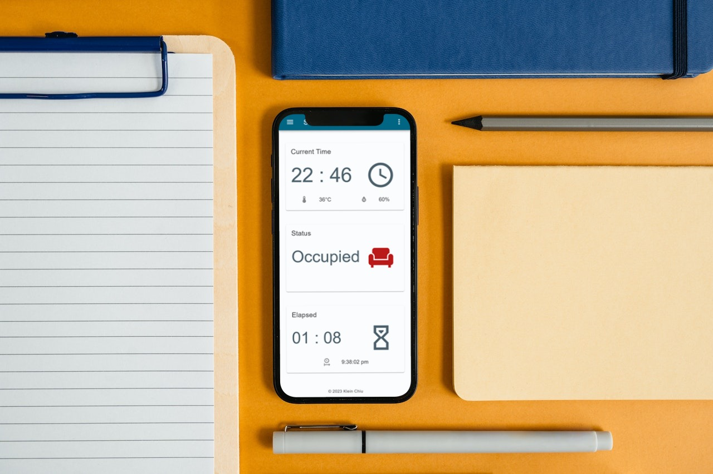
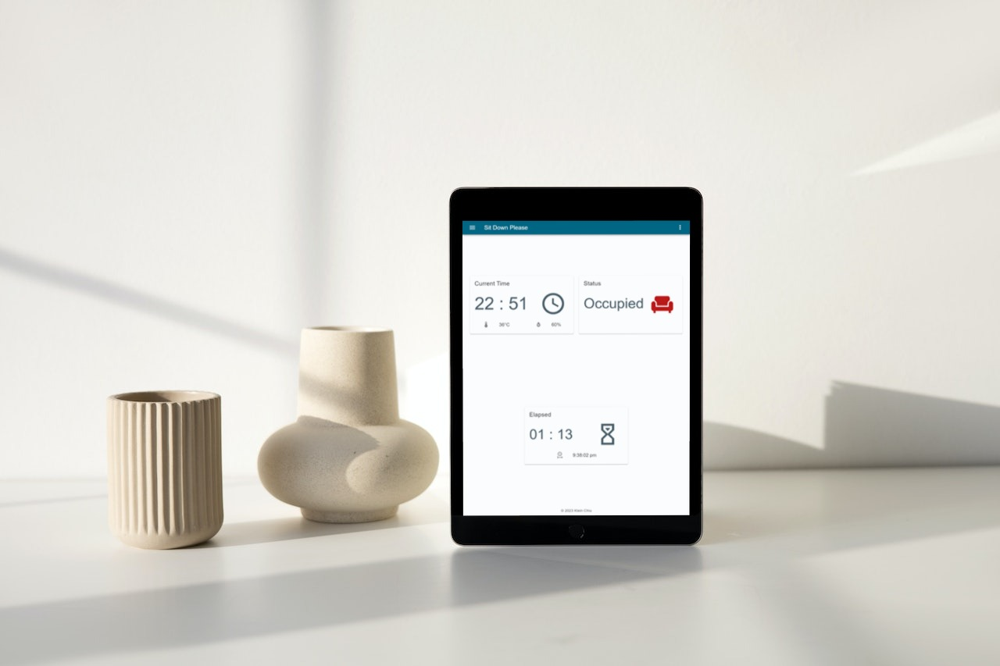
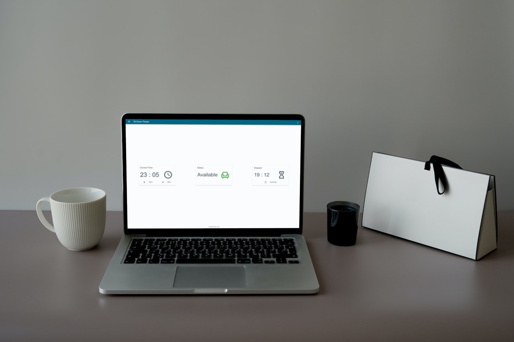

# Sit Down Please

[English](README.en.md)

図書館やネットカフェなど座席の貸し切りサービスのための IoT ソフトウェア

## 技術

- Nuxt.js
- Flask
- Raspberry Pi

## 機能

- 現在時刻を表示
- 在席・空席表示
- 在席の持続時間

## デモ画面





## 使い方

### インストール

GitHub からプロジェクトをクローンしてインストール

```sh
git clone https://github.com/KleinChiu/sit-down-please.git
```

クローンせずに GitHub から zip をダウンロードして解凍することもできますが、更新に手間がかかります。

依存性をインストール

```sh
sh install.sh
```

### 実行

```sh
pm2 start ecosystem.config.json
```

## 備考

Raspberry Pi 上で実行する IoT プロジェクトです。

## コントリビューション

いつでも PR をお待ちしております。

## ライセンス

MIT ライセンスをもとに公開しています。


